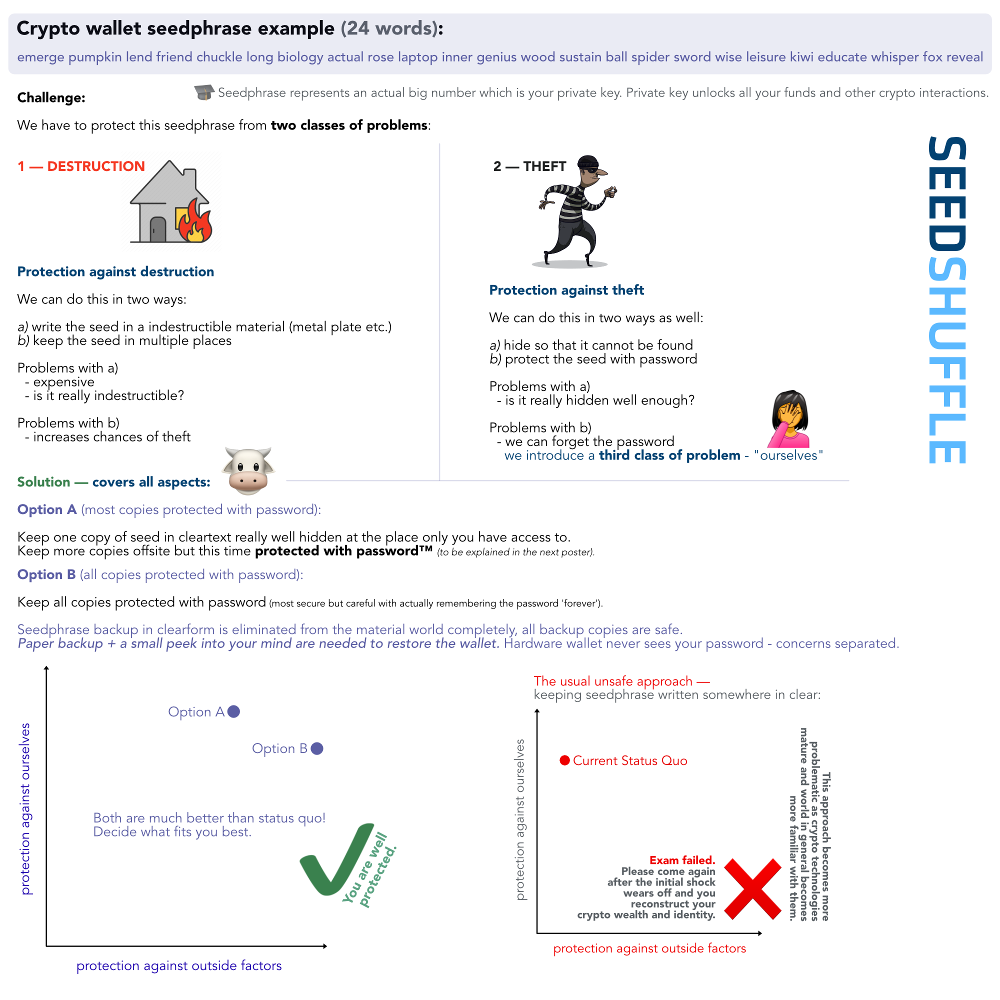
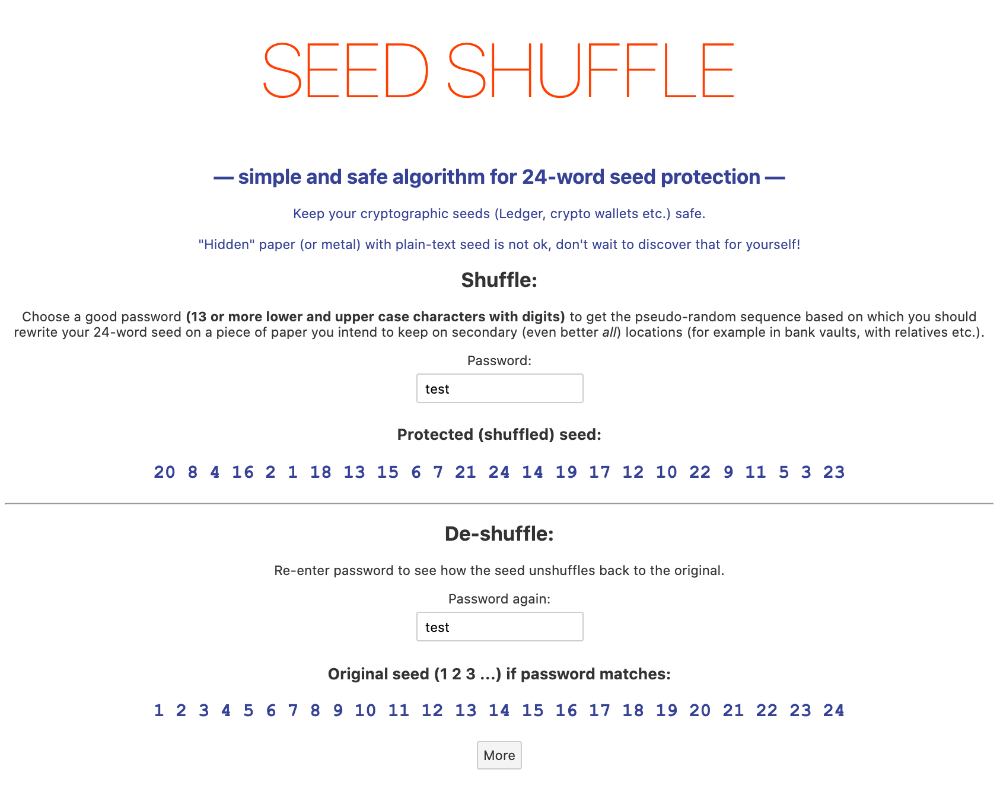

# seedshuffle
Protect 24-word seeds



## Try locally

```
npm install
npm run dev
```
Open `localhost:5000`.

## Online demo

⚠️  Do not enter real passwords. Site is not tracking them but you never know.

Online demo at <b>https://shuffle.dmt-system.com</b>:



## Warning / Disclaimer

⚠️  Only use this algorithm if you understand exactly how it works.

Author is certainly not reponsible for any financial loss in any case.

Math is clear, open (source), study and decide for yourself it you need this or some other more standard solution (BIP39). There are advantages and drawbacks to both (all).

## What you learn by studying the algorithm

- [SHA256](https://en.wikipedia.org/wiki/SHA-2)
- [Fisher–Yates shuffle](https://en.wikipedia.org/wiki/Fisher%E2%80%93Yates_shuffle)

**Fisher–Yates shuffle** is very nice and even kids can understand it. It is interesting to see how something this simple can deserve to carry the names of not one person but two people. Congrats on their invention! Science is incredible but think broader: <b>anyone can invent something useful</b>, sometimes it takes very little effort. It is also interesting that many experienced programmers get this wrong all the time and they produce permutations of sequences that are not really random.

So even if you don't use SeedShuffle _in production_, it is worth studying [how it works](https://github.com/dmtsys/seedshuffle/blob/main/lib/seedshuffle.js).

Try in command line:

```
cd lib
node seedshuffle
```

Result:

```
Mnemonic: endorse dignity they west worth thank drastic can eyebrow scan neither diagram tiger broken saddle unknown genius finger trumpet ride delay remain hard inside
Shuffled: worth scan neither tiger eyebrow thank hard trumpet broken drastic they remain inside saddle unknown ride west can endorse genius finger delay dignity diagram
Password: PASSWORD123
Security: 79 bits
```

You can use this script without GUI to inject your own actual seed if converting between "Word 1 .. 24" and seed is too much mental overhead.

⚠️⚠️  Of course you would use an offline, completely air-gapped computer for this.

If you do not have it, **do not enter actual seed** into either GUI or the script even on your local computer. Use offline manual (but error-prone) mapping with pen and paper instead. Be careful. Always.

If you looked into the algorithm and understand how it works then these warnings and descriptions will make total sense, otherwise please study the code first or just use the standard BIP39 solution with its specific set of drawbacks (with actual cruptographic security not being one of them).

## 🧠 The conclusion

**Use some method of protecting your clear-text seeds.**

Study the diagram / poster above and see why.

It is cheaper to take some time and learn this than to be sorry sooner or later.

> Investments in understanding and education are always worth the most.

## More details

...and some comparison with BIP39 standard approach:

see here for [details](DETAILS.md).
